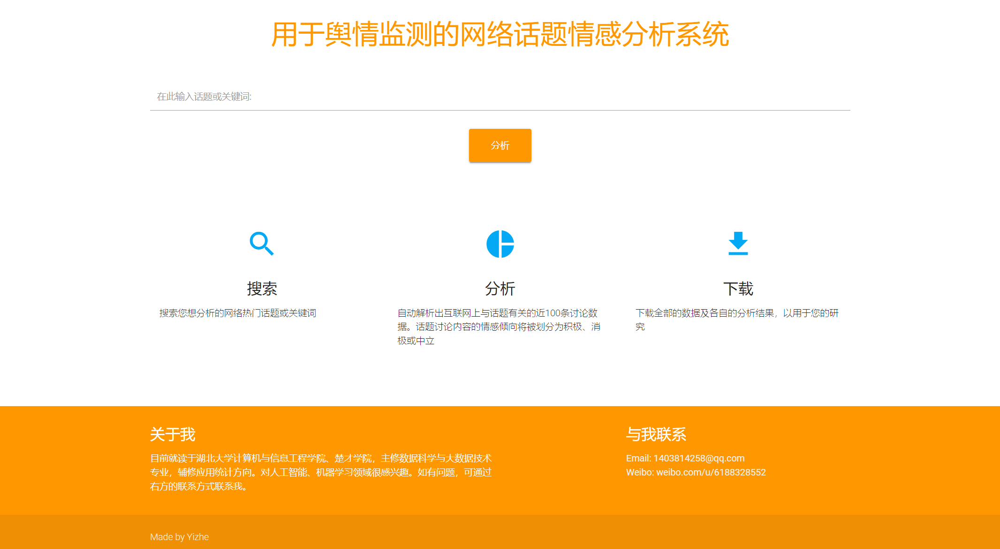

# 用于舆情监测的网络话题情感分析系统

该系统用于搜索相关话题下的讨论文本，并对其进行情感分析计算。用户可以了解到该话题下的讨论风向是积极、消极或中立，了解到该话题下的热频词汇，用户还可以下载分析数据用于自己的研究。

## 项目数据库配置

1. 创建一个MySQL数据库 `database1`
2. 在settings.py文件下配置好数据库信息
3. 在程序根目录下执行 `python manage.py makemigrations`和 `python manage.py migrate`

## 运行环境配置

1. 确保你的python根目录下有与你Google浏览器版本匹配的`chromedriver.exe`
2. 下载好所需要的依赖 `pip install -r requirements.txt`

## 正确运行的步骤

1. 确保weibo_topic_spyder.py文件下的`username`、`password`，和analysis.py文件下的`APP_ID`、`API_KEY`填写正确
2. 启动程序 `python manage.py runserver`

## Copyright © 2023
该系统的所有权利属于余艺喆